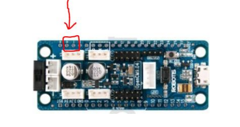
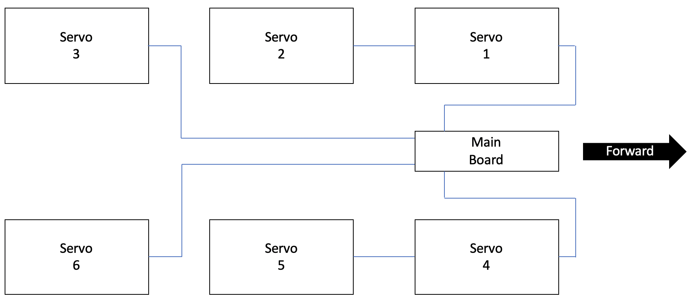

# MiniRHex Assembly Instructions

1. Solidworks files available in /CAD
    a. Any updated or changed SolidWorks parts will be uploaded here
  
2. Look at the MiniRhexHardware file to see the needed parts and links to the items.
    a. McMaster: M3 locknuts, button head screws, and spacer; 3mm acrylic
    b. Amazon: Battery, Plastidip, charger, and battery connectors
    c. Robotis: Main board, Dynamixels, Bluetooth(optional)
  
3. Print the following (PLA), .stl files can be found in /CAD/STL
    a. 6 servo sleeve parts, for best results print with the back side on the build plate 
    b. 4 shaft-edge parts
    c. 2 shaft-mid parts 
    d. 1 battery case part 
    e. 6 leg parts
    f. if you have access to an Ultimaker 3 Extended printer gcode can be found in /STL 
  
4. Open base.sldprt and save as a .dxf file. Use this file to laser cut 3-mm thick acrylic to
serve as the foundation for the robot.

5. Prepare the mainboard for use.
  a. Solder the battery connector onto one positive pinhole and one negative pinhole
  for power. The location on the board is shown below
  
  
  
6. First, connect the battery case and mainboard to the foundation, with the USB port facing outwards
  a. Connections:
    i. Battery case: M3 button head x 10 mm, M3 nut
    ii. Mainboard: M3 spacer, M3 button head x 10 mm, M3 lock nut
  b. Battery case is near the center of the foundation.
  c. The mainboard’s micro-USB port should face out.
  d. The mainboard will be towards the front of the robot.
  
7. Next, prepare the legs by using Plastidip (either dip or spray) and coating each of the six
legs until high friction surface forms on each leg.
  a. Between each coat, let dry for at least one hour.
  b. Make sure the dip is evenly coated around the leg.
  c. Do not cover the through holes for the screws.
  
8. Connect four of the six legs to edge shafts (shorter shafts).
  a. Align the leg through holes with the holes on the cut-out portion of the shaft.
  b. Connection: M3 socket head x 10 mm
  c. For two of the four connections, be sure to switch the orientation of the leg
  because those will be attached to the opposite side of the robot.
  
9. Connect the other two legs to the mid shafts (longer shaft).
  a. Align the leg through holes with the holes on the cut-out portion of the shaft.
  b. Connection: M3 socket head x 10 mm
  c. For one of the two connections, be sure to switch the orientation of the leg
  because those will be attached to the opposite side of the robot.
  
10.Connect each shaft-leg apparatus to the Dynamixel XL-320 servo motor.
  a. Orientation: Make sure the half circle each leg forms faces the front of the robot:
  towards the side with the mainboard.
  b. Detach the center screw in the servo horn, and pry off the horn itself.
    i. The horn looks like a small, black plastic cylinder.
  c. Align the 4 through holes on the servo horn with the 4 extruded pieces on the shaft
  face (the shaft length doesn’t matter).
  d. Align the horn (now connected to the leg apparatus) to its key on the body of the servo.
    i. Once the horn is flush against the body, connect the horn/shaft/leg apparatus
    to the servo motor.
    ii. Connection: center screw that came with the servo

12.Slide each servo into a servo sleeve.

13.Connect each servo sleeve to the foundation.
  a. Orientation: Be sure all legs face forward (semicircle faces the mainboard).
  b. Connection: M3 button head x 10 mm, M3 nut
  
14.Connect the servos to the mainboard.
  a. Connect such that no wires interfere with leg rotation.
15. Charge battery(ies) and check voltage(s).

16.Upload code using the micro-USB port.

17.Take electronic wires that come with the servos, and connect them like below

 

