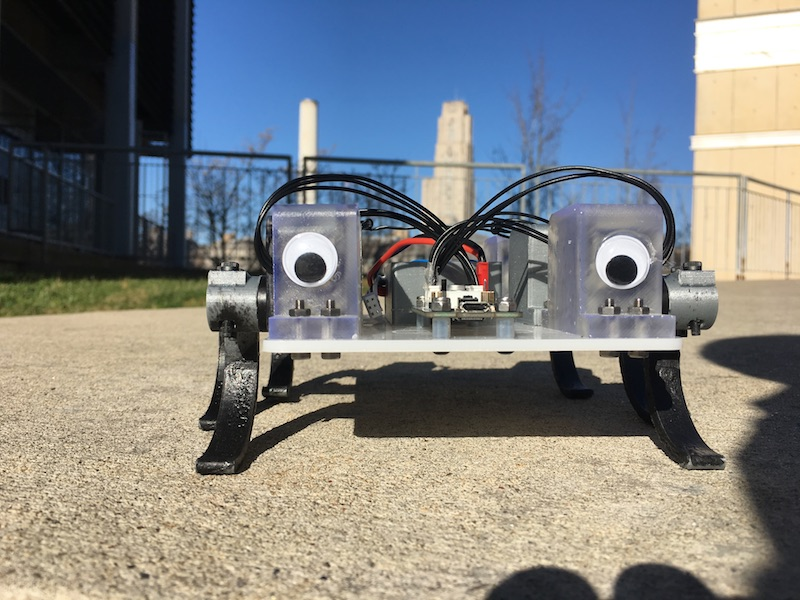

**MiniRHex: An Open-Source Hexapod Robot**

Contact: nflowers@andrew.cmu.edu

MiniRHex is a miniature scale hexapod heavily based on the design of RHex. Notable features include a laser-cut frame and 3D printed legs for low cost construction and an intuitive software package that allows for highly-customizable control over the robot’s behavior. MiniRHex is designed to be an educational and outreach tool to allow students to experiment with a fully functional walking robot at a much lower cost. The low price tag lets research groups maintain a fleet of machines, allowing each student more hands-on interaction with the hardware. Possible educational principles include gait design and optimization, leg design and control, and mobile robot sensor incorporation.

# Setup Instructions
Building a MiniRhex requires access to a 3D printer and laser cutter. The links for off the shelf parts can be found below.

### Acquire Parts
The Parts List and Links to order can be found in [Parts List](https://github.com/robomechanics/MiniRHex/tree/master/HardwareList).

### Assemble Robot
Assembly Instructions available at [Assembly Instructions](https://github.com/robomechanics/MiniRHex/tree/master/Assembly).

### Install Software
1. Install OpenCM IDE from [http://www.robotis.us/opencmide/](http://www.robotis.us/opencmide/)
2. Clone primary repository at [https://github.com/robomechanics/MiniRHex.git](https://github.com/robomechanics/MiniRHex.git)

### Configure Servo ID's
1. In the openCM IDE, go to File>Examples>Dynamixel Easy>b_setID
2. Change the NEW_ID variable to the ID number according to the diagram below
3. Attach only the corresponding servo to the board (disconnect any other servos)
4. Upload the code
5. Repeat steps b-d for each servo

### Set Leg Zeros
1. Clone support repository at [https://github.com/nikolaif399/zero_finder.git](https://github.com/nikolaif399/zero_finder.git)
2. Manually rotate each leg to be as close to straight down as possible
3. Download zero_finder.ino to the OpenCM
4. Open the serial monitor in the IDE and copy the zeros (printing) to the zeros array in leg_info.cpp

# Operating Instructions
1. Connect the MiniRHex to your computer via the Micro USB port
2. Open MiniRHex.ino in the OpenCM IDE and check that under "Tools":
   - "Board" is set to ROBOTIS OpenCM9.04
   - "Port" is set to the correct COM port (whichever COM port is added when MiniRhex is plugged in)
3. Ensure the motor zeros in leg_info.cpp are correct
4. Set desired gait parameters in gait_parameters.cpp
5. Click the download icon in the upper left corner of the OpenCM IDE (wait until it reports "Done Downloading")
6. Disconnect the Micro USB cable and connect the battery
7. Flip the power switch on the OpenCM board
8. Press the "RESET" button, make sure all motor LEDs are green
9. Press "USER SW" to execute the code!
10. Press the "RESET" button again to return to the standing behavior

# Robot Specifications

# Useful Links
### Parts List
The part list can be found at [Parts List](https://github.com/robomechanics/MiniRHex/tree/master/HardwareList).
### MiniRhex Repository
The MiniRhex repository can be found at [MiniRhex Repository](https://github.com/robomechanics/MiniRHex.git).
### Cite MiniRHex
If referencing MiniRHex in a paper, please cite [this abstract](http://www.andrew.cmu.edu/user/amj1/papers/RSS2018ws_MiniRHex.pdf).
Use [this BibTeX](https://github.com/robomechanics/MiniRHex/blob/master/citation.txt) for citations.
### Images
See the [image gallery](https://robomechanics.github.io/MiniRHex/Images/) for more MiniRHex pictures.

### Videos
Check out the Robomechanics Lab [YouTube Page](https://www.youtube.com/channel/UCKD78aZAsdB9-JTwrt6Q1KA) for videos of MiniRHex in action!

# Contributors
Nikolai Flowers (BS ME '20)
Barrett Werner (MS ME '19)
Monica Barragan (BS ME '19)
Cameron Selby (MS ME '18)
Scott Phillips (BS ME '20)
John Payne (Ph.D ME)
Joe Norby (Ph.D ME)
Aaron Johnson (Advisor)

