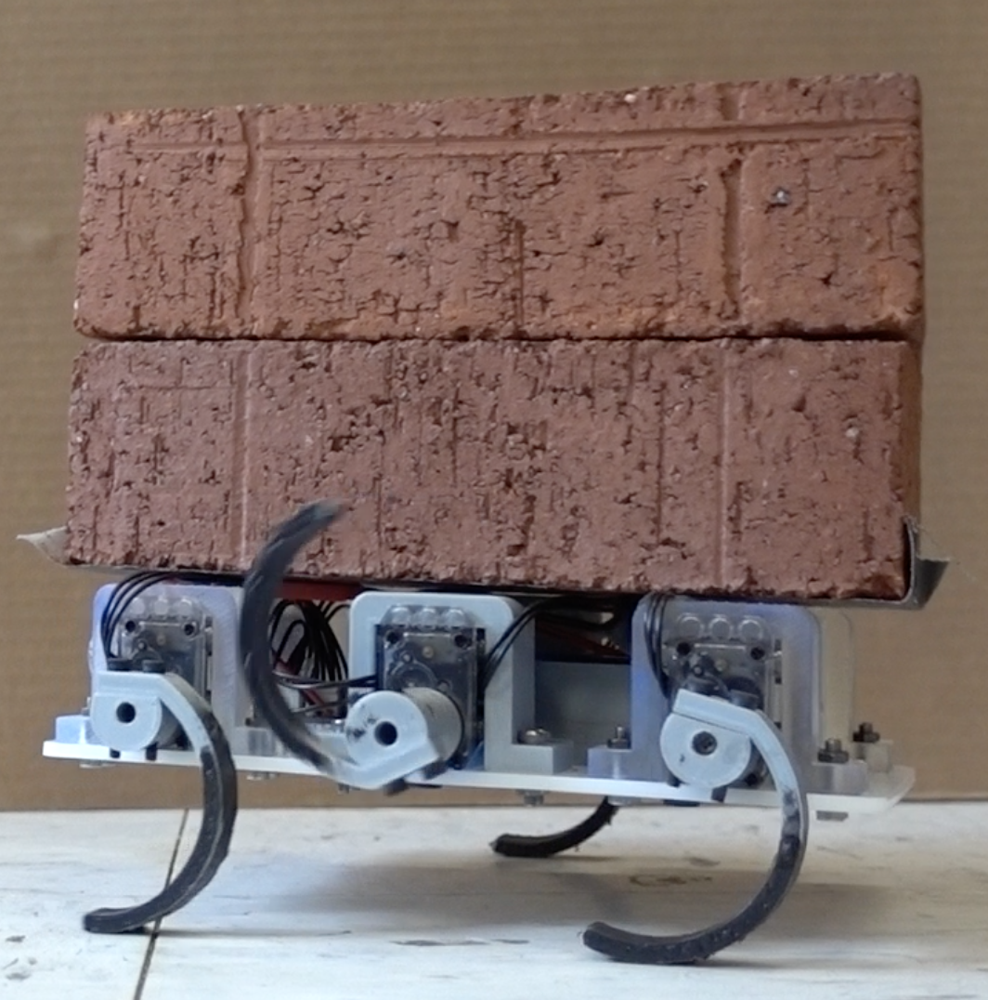
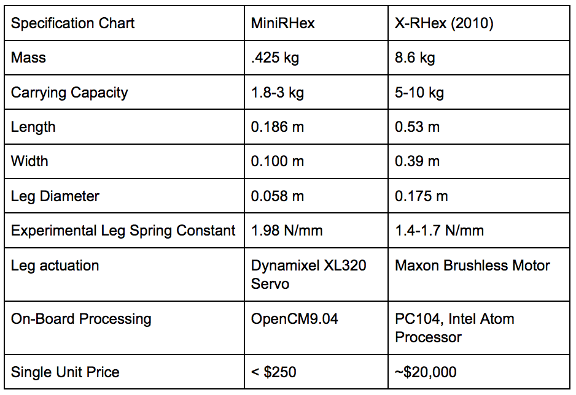

# MiniRHex: An Open-source Walking Hexapod

MiniRHex is a miniature scale hexapod heavily based on the design of RHex. Notable features include a laser-cut frame and 3D printed legs for cheaper construction and an intuitive software package that allows for highly-customizable control over the robot’s behavior. MiniRHex was designed to be an educational and outreach tool to allow students to experiment with a fully functional walking robot at a much lower cost. The low price tag lets research groups maintain a fleet of machines, allowing each student more hands-on interaction with the hardware. Possible educational principles include gait design and optimization, leg design and control, and mobile robot sensor incorporation.

## Setup instructions

### Hardware
Assembly Instructions available in git repository under Assembly_Instructions.pdf

### Software
1. Install OpenCM IDE from http://www.robotis.us/opencmide/
2. Clone primary repository at https://github.com/robomechanics/MiniRHex.git
3. Clone support repository at https://github.com/nikolaif399/zero_finder.git
4. Open OpenCM IDE, open calculate_zeros and run
5. Pull up serial monitor, move legs to face directly downward and copy zeros over to array in leg_info.cpp
6. Open MiniRHex.ino, attach micro-usb to robot and download code to robot
7. Use user button on robot to toggle through gaits (stand, forward, left, reverse, right, pronk)

### Specifications

