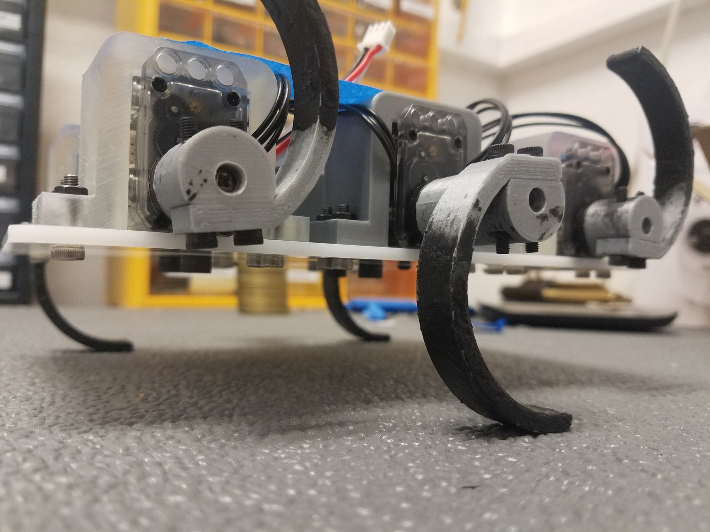

# MiniRHex: An Open-source Walking Hexapod
Contact: nflowers@andrew.cmu.edu

MiniRHex is a miniature scale hexapod heavily based on the design of RHex. Notable features include a laser-cut frame and 3D printed legs for cheaper construction and an intuitive software package that allows for highly-customizable control over the robot’s behavior. MiniRHex was designed to be an educational and outreach tool to allow students to experiment with a fully functional walking robot at a much lower cost. The low price tag lets research groups maintain a fleet of machines, allowing each student more hands-on interaction with the hardware. Possible educational principles include gait design and optimization, leg design and control, and mobile robot sensor incorporation.

## Setup Instructions

### Hardware
Assembly Instructions available at https://github.com/robomechanics/MiniRHex/assembly_instructions.pdf

### Software
1. Install OpenCM IDE from http://www.robotis.us/opencmide/
2. Install R+ Manager from http://www.robotis.us/roboplus2/
3. Clone primary repository at https://github.com/robomechanics/MiniRHex.git

### Leg Configuration
Several variables will have to be configured for each leg before we can upload code from the primary repository. First, we need to match the ID of each dynamixel servo to the diagram shown below. ID's can be changed using the OpenCM board and R+ manager. Next we need to set the servo zeros of each dynamixel. Due to slighly mechanical differences and leg mounting imperfections, each leg's zero position may not naturally point straight down. To fix, Clone support repository at https://github.com/nikolaif399/zero_finder.git and run zero_finder.ino on the OpenCM. Manually rotate each leg to be as close to straight down as possible. Open the serial monitor in the IDE and copy the zeros (printing) to the zeros array in leg_info.cpp.

Open OpenCM IDE, open calculate_zeros and run
5. Pull up serial monitor, move legs to face directly downward and copy zeros over to array in leg_info.cpp
6. Open MiniRHex.ino, attach micro-usb to robot and download code to robot
7. Use user button on robot to toggle through gaits (stand, forward, left, reverse, right, pronk)

### Specifications

